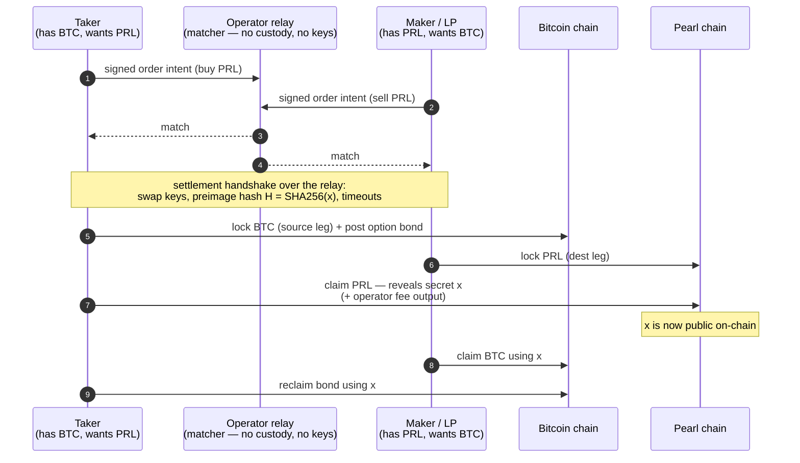

# pearl-dex

A **trustless, non-custodial, peer-to-peer exchange** between **Pearl (PRL)** and **Bitcoin (BTC)**.

You bring your own wallet. The two sides of a trade settle directly on-chain via an atomic swap. The
operator runs the venue — it matches orders and relays messages — but **never holds your funds, never
quotes a price, never provides liquidity, and never holds a key.** It's a DEX, not a custodian and
not a wallet.

- **Users are both sides of the market.** Makers and takers (and optional third-party liquidity
  providers) bring the liquidity. The operator is a pure matcher/relay.
- **Off-chain matching, on-chain settlement.** Orders are *signed intents*, not deposits. Settlement
  is a cross-chain atomic swap: a hashlock makes it all-or-nothing, timelocks return your funds if
  the counterparty vanishes. Neither side can steal — principal is always protected.
- **Forfeitable, secret-tied bonds** address the *free-option problem* that has historically plagued
  atomic-swap DEXs (see [the honest caveats](#the-free-option-problem-and-the-bond) below).

> Sibling to [`pearl-swap`](https://github.com/kingonly/pearl-swap) (the liquidity-provider swap
> engine) and [`pearl-lightning`](https://github.com/kingonly/pearl-lightning) (Lightning on Pearl).
> pearl-dex reuses pearl-swap's proven taproot atomic-swap core, refactored from an LP counterparty
> into a pure non-custodial coordinator of two user wallets.

**Read [`DESIGN.md`](./DESIGN.md) for the full protocol** and [`MATURITY.md`](./MATURITY.md) for an
honest, layer-by-layer assessment of what is battle-tested vs. novel vs. experimental.

---

## How a swap works

A taker wants PRL and has BTC; a maker (or an LP) wants BTC and has PRL. They never trust each other
or the operator. BTC→PRL shown; PRL→BTC is symmetric.



The magic step is **5**: to take the PRL, the taker must reveal the secret `x` on the Pearl chain.
That same `x` is what the maker needs to take the BTC (step 7). One secret unlocks both legs, so the
swap is atomic — either both claims happen or, on a stall, both sides refund after their timeouts.

The operator only does steps 1–4 (match + relay the handshake). Steps 5–8 are pure user-to-chain;
the operator isn't even involved and couldn't interfere if it wanted to.

### If something goes wrong

Every locked output has a **refund path** that opens after a timeout, so no one can be left out of
pocket:

- **Maker never funds PRL** → the taker just refunds its BTC (and reclaims its bond) after the source
  timeout. Nothing was given away.
- **Taker walks** (locks up, then declines to claim because the price moved) → the maker refunds its
  PRL after the dest timeout, and **forfeit-claims the taker's bond** as compensation.

---

## Architecture

Four layers, strict separation, **custody only ever at the edges (the users)**:

```
                        ┌───────────────────────────────────────────────┐
   operator runs ──▶    │  src/coordination   (the venue — zero custody) │
                        │  OrderBook · Handshake · RelayServer/WsRelay   │
                        │  Registry · MakerReputation                    │
                        └───────────────────────────────────────────────┘
                                          ▲   signed intents / handshake
                                          │   (no funds, no keys cross here)
        ┌─────────────────────────────────┴─────────────────────────────────┐
        │                                                                     │
   ┌─────────────────────────────┐                       ┌─────────────────────────────┐
   │  src/client  (one per user) │                       │  src/client  (counterparty) │
   │  SwapClient + SwapExecutor  │                       │  SwapClient + SwapExecutor  │
   │  Signer (keys) · SwapWallet │                       │  Signer (keys) · SwapWallet │
   └──────────────┬──────────────┘                       └──────────────┬──────────────┘
                  │                                                      │
                  └──────────────► src/settlement ◄──────────────────────┘
                      atomic swap legs + secret-tied bond (taproot HTLCs)
                      ChainClient → Bitcoin chain  +  Pearl chain
```

| Layer | Responsibility | Custody |
|---|---|---|
| `src/coordination` | Signed intents, the crossing matcher (`OrderBook`), settlement handshake, relay (`RelayServer`/`WsRelay`), discovery (`Registry`), anti-grief (`MakerReputation`) | **none** |
| `src/settlement` | Cross-chain atomic swap legs + secret-tied bond, timelock math, chain clients | none — funds sit in user-controlled HTLCs |
| `src/client` | `SwapClient` — the object a user runs: posts intents, runs the handshake, drives its `SwapExecutor`; plus `Signer` and `SwapWallet` | self-custody (user only) |
| `src/signer` | The signing seam: `Signer` interface + `LocalSigner` (held key; a Privy/remote signer slots in here) | key authority, **not** fund custody |
| `src/common` | Shared types, Pearl/BTC network params, tapscript helpers | — |

---

## Roles

| Role | Who | Brings | Holds funds? | How they're made whole |
|---|---|---|---|---|
| **Taker** | a user | the secret + the price option; funds source leg + posts the bond | own wallet only | gets dest leg; bond back on consummation |
| **Maker** | a user or LP | the resting order; funds dest leg | own wallet only | gets source leg; forfeits-claims bond if taker walks |
| **Operator** | you (the venue) | matching + relay + a frontend | **never** | a fee on matched volume (see below) |
| **LP** *(optional)* | anyone | their own capital + an always-on `MarketMaker` daemon | own wallet only | the spread; fixes cold-start so a lone taker always fills |

---

## The free-option problem and the bond

In any timelocked cross-chain swap, **whoever reveals the secret last holds a free option**: they can
wait, watch the price, and walk away (forfeiting nothing) if it moves against them — after the
counterparty is already committed. This has historically made atomic-swap order books unviable.

pearl-dex makes that option **paid, not free**: the option-holder (the taker) posts a **secret-tied
bond** — a small extra HTLC committing to the *same* preimage hash as the swap.

- **Reclaim leaf:** the taker reclaims the bond by revealing `x` — which consummating the swap does
  anyway. So an honest taker always gets it back.
- **Forfeit leaf:** if the taker walks (never reveals `x`), the maker claims the bond after a
  timeout — compensation for the option the taker held.

The bond timelocks sit in a strict ladder so a walk is penalizable but principal is never at risk:

```
   time ──────────────────────────────────────────────────▶

   destTimeout (PRL)  ──┐  taker must claim dest before here
                        │
   bondForfeit (BTC)  ──┼──┐  maker may forfeit-claim the bond after here
                        │  │
   sourceTimeout (BTC)──┴──┴──  taker may refund its source principal after here

        destTimeout   <   bondForfeit   <   sourceTimeout      (enforced)
```

> **Honest status.** The *mechanism* is implemented and tested; bonds enforced this way are lightly
> deployed in the wild (Komodo-style). The bond is sized **conservatively to dominate the option**:
> `bond = max(flat-floor, safety · 0.4 · σ · √T · notional)` with deliberately pessimistic defaults
> (σ = 300% annualized, 2× safety; see `src/settlement/FreeOption.ts`), so a walk is never profitable
> even for a volatile pair — erring large only costs an honest taker locked capital for the swap
> window, which it always gets back. One caveat we don't hide: a *maker* who accepts-then-never-funds
> can grief a taker out of its bond — principal is always safe, and this is mitigated by reputation,
> not yet closed cryptographically. See [`MATURITY.md`](./MATURITY.md) and
> [`docs/maker-grief-analysis.md`](./docs/maker-grief-analysis.md).

---

## Custody & signing — why there's no wallet to trust

pearl-dex is a DEX, not a wallet. Two design choices keep it that way:

**1. Funding is watch-for-deposit, not spend-your-balance.** A user funds a swap by sending to the
lockup address **from their own wallet**; the app (`WatchDepositWallet`) just shows "send X here" and
watches the chain for it. On the BTC leg that's the Bitcoin wallet you already have; on the PRL leg
it's your Pearl/Privy wallet. The app never touches your balance. (`ReferenceWallet`, which *does*
spend its own UTXOs, exists for the unattended **LP daemon** — not for end users.)

**2. Signing goes through a seam, not a stored key.** Claim/refund/bond signatures are produced by a
`Signer` that only signs a 32-byte hash — satisfied by a `LocalSigner` (held key, for the LP/tests)
or by a remote/embedded signer like Privy in a browser. The signer is **claim/refund authority only**;
funds always pay out to the user's own address. So a browser user can trade without the app ever
holding their key.

```
  user's own wallet ──send──▶  swap lockup (taproot HTLC)  ──claim──▶  user's own address
        (funding)                       ▲                    signed by
                                        │                    Signer (key never leaves user)
                          app only WATCHES for the deposit
                          and helps assemble the claim
```

---

## Monetization — making money without custody

The operator earns a **fee on matched volume while holding nothing** — the same way a non-custodial
DEX frontend does (MetaMask's swap fee, the Uniswap interface fee). The client your site ships builds
the taker's dest-leg claim with **an operator-fee output baked in**, and the user's own signer signs
that claim. No fill, no fee; the taker bears it out of what they receive.

```
   taker's dest claim (PRL):
   ┌──────────────────────────────────────────────────────┐
   │ in:  dest lockup (PRL)                                │
   │ out: taker payout  = dest − operatorFee − minerFee    │  ──▶ taker's own address
   │      operator fee  = feeBps · notional (floored)      │  ──▶ operator address
   └──────────────────────────────────────────────────────┘
```

`feeBps` is a **signed field of the order intent**, so the matcher only crosses orders that commit at
least the operator's minimum. This is *frontend-fee* enforcement: it collects from everyone who uses
your site/client (which is ~everyone), and a sophisticated user running a forked client against their
own relay can bypass it. Making the fee unforkable even against pros would need the optional `OP_CAT`
covenant (Pearl-specific; parked as a future PoC, not a dependency). **The practical takeaway: own
the default frontend — that's the toll booth, and it isn't a wallet.** See `DESIGN.md` §10.

---

## Status

Every layer — from a signed order over a real WebSocket relay, through an LP that provides liquidity,
to on-chain settlement — is built, tested, and **proven live**.

- **60 unit/integration tests pass** + live tests (skipped offline): a full on-chain swap across two
  pearld nodes, and a `BitcoinClient` read-path check against a real synced bitcoind signet.
  Typecheck clean.

> **Live milestone:** two `SwapClient`s posted crossing signed orders → the relay matched them →
> handshake over the relay → executors settled a real cross-chain atomic swap across two live pearld
> simnet nodes. Verified on-chain: dest claim (taker received PRL), source claim (maker learned the
> preimage *from the chain* and claimed), and bond reclaim. See `test/live.simnet.test.ts`.

**Built:**

- **Settlement** — ported atomic-swap primitives (`SwapTree`, `Timelocks`, `Funder`, `ChainClient`);
  the secret-tied `Bond`; the `SwapPlan` two-user layout; live chain clients (`PearlClient` over
  pearld btcd-RPC, `BitcoinClient` over bitcoind Core-RPC, sharing an incremental block-scanning
  `RpcChainClient`).
- **Signing seam** (`src/signer`) — all claim/refund/bond signing routed through a `Signer` that only
  signs a hash; `LocalSigner` today, Privy/remote-ready for the browser.
- **Coordinator** — a crash-safe, idempotent, **deadline-driven & confirmation-gated**, fee-bumped
  (RBF) state machine (`SwapExecutor` + `SwapStore`).
- **Matching/relay** — crossing matcher (`OrderBook`: price-time priority, partial fills,
  fee/expiry/signature gates), settlement `Handshake`, transport-abstracted `RelayServer`, a real
  WebSocket transport (`WsRelayServer` + `connectWsRelay`), flat-file discovery (`FileRegistry`),
  anti-grief `MakerReputation`.
- **Monetization** — the operator fee is **wired into the taker's dest claim** (collected only on
  consummation), `feeBps` a signed intent field.
- **Client & wallets** — `SwapClient` (posts intents, runs the handshake, drives its executor, with
  `resume()` crash-recovery); **`WatchDepositWallet`** (non-custodial user funding) and
  `ReferenceWallet` (the LP daemon's own-capital wallet); a third-party LP daemon (`MarketMaker` +
  `SpreadPolicy`) that keeps fresh resting quotes so a lone taker always fills (the cold-start fix).

**Next:** a patient real BTC↔PRL signet run end-to-end; σ·√T-aware bond sizing; the browser client
(Privy signer + watch-for-deposit); the venue/UX frontend (the real moat). The `OP_CAT` covenant
remains an optional later PoC, not a dependency. See `DESIGN.md` §9.

---

## Stack & quickstart

TypeScript (ESM, NodeNext), `@scure/btc-signer` via `boltz-core`, `@noble/curves`, vitest. Node ≥ 20.10.

```bash
npm install
npm test          # 60 tests (live tests skip unless backends are up)
npm run typecheck
```
